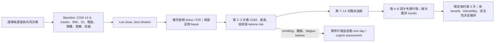

# T1D 使用 GLP-1／GLP-1–GIP receptor agonist：2026 共識報告詳解與安全實作

> 臨床／研究教育用途；不是個別病人的處方或胰島素調整醫囑。T1D 絕不可停用 basal insulin。藥品適應症、給付與 peri-procedural 規範會隨地區及時間改變，實際處置須由熟悉 T1D、CGM/AID 與 ketone management 的團隊共同決定。

## 一、先說結論

2026 年 Garg 等人的報告，是目前針對 **type 1 diabetes（T1D）中使用 semaglutide 等 GLP-1 receptor agonist，以及 tirzepatide 等 dual GLP-1/GIP receptor agonist** 最完整的實務安全共識之一。它由國際成人／兒童內分泌、糖尿病科技、營養與病人代表參與，並獲 **ATTD、IDF-Europe、AACE、Breakthrough T1D、ISPAD、ADCES** endorsement。

但 endorsement 的正確解讀是「專業組織認可這份共識作為臨床教育與決策參考」，**不是** FDA、TFDA 或 EMA 已核准這些藥治療 T1D，也不是大型 phase 3 T1D RCT 已證實長期利益。某位 T1D 患者可能因 obesity 適應症合法接受治療；這與「T1D 適應症」仍是兩件事。

臨床上最合理的總結是：

1. 對 T1D 合併 overweight／obesity、insulin resistance、體重與血糖目標皆未達者，GLP-1/GIP therapy 可能同時降低體重、餐時胰島素需求，並小幅改善 HbA1c／TIR。
2. 它是 **adjunctive therapy**，不是 insulin replacement。真正危險的往往不是藥本身單一作用，而是 appetite／carbohydrate intake 快速下降後，胰島素調整過頭，導致 hypoglycemia 或 insulin deficiency、euglycemic ketosis／DKA。
3. 安全使用的核心是 **low and slow、CGM-guided、先調 bolus、保留足夠 basal、主動驗 ketone、密集早期追蹤**。
4. 近期小型 RCT 已比過去更具說服力，但長期心腎、死亡、兒童、正常 BMI、retinopathy、lean mass 與罕見安全事件仍未定論。
5. 共識內有兩個需公開註記的錯誤／矛盾：`200 mg/dL` 的 mmol/L 換算誤植，以及 graphical abstract 與正文 peri-procedural guidance 不一致。

## 二、這份共識回答了什麼，又沒有回答什麼？

### 它回答得最好的是「安全流程」

- 如何選擇可能受益者，而非把所有 T1D 視為同質族群。
- 起始與升階時如何用 CGM 調整 insulin。
- 如何辨認 GI adverse effects 與 ketosis 症狀重疊。
- AID algorithm、manual basal profile 與 insulin-to-carbohydrate ratio（ICR）如何重新檢視。
- diabetic retinopathy、nutrition／lean mass、pregnancy、oral drug absorption 與 procedures 的風險管理。

### 它不能證明的事

- 無法證明 GLP-1/GIP therapy 在 T1D 可降低 myocardial infarction、stroke、ESRD 或 mortality；現有訊號來自 observational study／target-trial emulation。
- 無法證明 tirzepatide 在 T1D 一定優於 semaglutide；沒有 head-to-head RCT。
- 無法建立兒童、青少年、正常 BMI、反覆 DKA、severe gastroparesis 或 advanced retinopathy 的普遍安全性。
- 無法用 A/B/C/E 字母替代獨立 GRADE certainty。原文未定義這套字母，也沒有完整呈現投票門檻、formal risk-of-bias 或 evidence-to-decision framework。

## 三、為什麼 T1D 可能受益？

T1D 的核心缺陷是 absolute insulin deficiency；GLP-1/GIP agonism 不會取代外源 insulin。不過許多成年 T1D 同時有 overweight／obesity、insulin resistance、高 TDD、postprandial excursion 與 cardiovascular risk。GLP-1/GIP therapy 可透過 satiety、降低能量攝取、延緩 gastric emptying、降低 glucagon 與改善 insulin sensitivity，間接降低餐時 insulin 需求及餐後波動。

這也解釋主要風險：若食量與吸收速度先下降、原 bolus 尚未調整，容易 hypoglycemia；若因怕低血糖或 GI 不適而把 insulin 尤其 basal 減得過度，則可能在 glucose 並不極高時發生 ketosis。

## 四、目前療效證據有多大？

### 1. Semaglutide + AID crossover RCT

Pasqua 等人納入 28 位成人、24 位完成 crossover trial；semaglutide（最高每週 1 mg）相較 placebo 使 TIR 增加 **4.8 percentage points**，未增加 TBR。試驗沒有 DKA 或 severe hypoglycemia，但 semaglutide 期間有 **2 位 recurrent euglycemic ketosis without acidosis**。這支持「可改善 AID 下的血糖」，也同時提醒正常血糖不排除 ketone risk。

### 2. ADJUST-T1D RCT

72 位 T1D、BMI ≥30 kg/m² 且使用 AID 的成人，接受 26 週 semaglutide 或 placebo。達成「TIR >70%、TBR <4%、體重下降 ≥5%」複合終點者為 **36% vs 0%**；組間 HbA1c 約改善 **0.3 percentage points**、TIR 約增加 **8.8 percentage points**、體重約少 **8.8 kg**。兩組 severe hypoglycemia 各 2 件，無 DKA。這是很有臨床意義的 proof-of-concept，但族群小且特定，不能直接外推到非 obesity、未用 AID 或高 DKA risk 者。

### 3. Tirzepatide phase 2 RCT

24 位成人隨機分派、22 位完成 12 週；tirzepatide 由 2.5 mg 進至 5 mg。相較 placebo，體重組間差約 **−8.7 kg**（約 8.8%），HbA1c 差約 **−0.4 percentage points**（P=.05），TDD 相對變化約 **−35.1%**。未見顯著嚴重 adverse events，但樣本過小，且排除近期 DKA／severe hypoglycemia、gastroparesis、部分 retinopathy、eGFR <45 與 pregnancy，故安全性可推廣範圍有限。

### 4. 2026 RCT meta-analysis

Purcell 等整合 13 個、至少 12 週、成人 T1D 且 BMI ≥25 kg/m² 的 RCT：平均體重 **−4.31 kg**、HbA1c **−0.25 percentage points**、TDD **−9.24 U/day**；hypoglycemia 增加（OR **1.34**），GI adverse events 增加，而 hyperglycemia 減少。由於藥物世代、劑量、insulin protocol 與 outcome definition 異質，這是平均效果，不是任何個別藥／個別病人的保證。

### 5. 真實世界與心腎訊號

共識整理的 ≥12 個月 observational cohorts 多顯示 HbA1c 約下降 **0.3–1.1 percentage points**、TIR 增加 **4.5–25 percentage points**，semaglutide 體重約下降 9%，tirzepatide 約 10–23%；但樣本小、處方選擇偏差、失訪與 adverse-event underreporting 都很可能存在。

2026 target-trial emulation 包含 174,678 位 T1D；GLP-1 RA 使用與 5 年 MACE（HR 0.85）及 ESRD（HR 0.81）較低相關。這是值得進一步驗證的訊號，**不是因果證明**；被選擇 off-label 用藥者可能較健康、資源較佳、追蹤較完整，residual confounding 無法排除。

## 五、哪些病人最可能是候選者？

共識把最清楚的成人候選族群對齊既有 weight-management principles：

- BMI ≥30 kg/m²；或
- BMI ≥27 kg/m² 且有 weight-related comorbidity，例如 hypertension、dyslipidemia、obstructive sleep apnea 或 cardiovascular disease；或
- 即使 BMI <27 kg/m²，密集 insulin therapy 後仍持續 hyperglycemia，且希望在不增加低血糖下改善血糖；此情境證據更弱，應更審慎。

候選評估不能只看 BMI。還應評估：既往 DKA／severe hypoglycemia、是否會驗 blood ketone、CGM 可用性、AID／MDI 操作能力、GI symptoms／gastroparesis、眼底病變、renal function、eating disorder／intentional insulin omission、nutrition、frailty／sarcopenia、pregnancy planning、口服藥物與 planned procedures。

下列情境通常不宜貿然開始，或需先穩定問題並由專科團隊決策：active pregnancy／備孕、近期反覆 DKA 或嚴重 insulin omission、無法監測 ketone、severe gastroparesis／持續嘔吐、active proliferative retinopathy 或 macular edema 尚未穩定、顯著 malnutrition／frailty、疑似 eating disorder、無法安全持續 insulin 與追蹤者。

## 六、安全起始與追蹤：一個可執行但非處方化的流程

### 起始前

1. 取得至少 14 天 CGM：TIR 70–180 mg/dL、TBR <70／<54、overnight pattern、post-meal excursion、insulin suspension 與 auto-correction。
2. 記錄 basal／bolus／TDD、ICR、correction factor、AID model 與 manual-mode settings。
3. 處理 reflux、constipation、diarrhea、早飽或疑似 gastroparesis；建立 hydration 與 sick-day plan。
4. 教會 patient／family：GLP-1/GIP 不取代 insulin；何時驗 blood ketone；GI symptom 與 ketosis 可能長得相似；何時緊急就醫。
5. 依風險確認近期 retinal assessment、pregnancy／contraception、nutrition／protein intake、resistance exercise 與 oral medication absorption。

### 起始與升階

- **Low and slow**：由最低劑量開始；多數產品每 4 週才升一階，耐受不佳或 T1D 風險較高者可每 2–3 個月才調整。
- 共識中的 insulin reduction 是「起始參考」，不是通用處方。原則是先處理 prandial insulin／ICR，避免為了防低血糖而過度砍 basal。
- 起始或每次升階後約 **2–3 天**先看 CGM 與 intake；第 **7 或 14 天**臨床接觸，之後升階期每 **4–8 週**，穩定後約每 **3 個月**。每次就診都重評 insulin regimen。
- 成人研究中 TDD 最終可能下降約 25–35%，但不是一開始一次砍掉的固定比例。

## 七、共識 Table 2：insulin 起始調整框架

以下是原文 panel 的 **starting suggestion**；在升階期應以 CGM 優先於 HbA1c，並依 hypoglycemia、meal size、AID response 與 ketosis risk 個人化。

| Baseline 狀態 | MDI basal | MDI bolus | AID basal | AID bolus |
|---|---:|---:|---:|---:|
| TIR <50%、TBR <4% | 不變 | 不變 | 不變 | 不變 |
| TIR 50–60%、TBR <4% | −10% | −10% | 不變 | −10% |
| TIR 60–70%、TBR <4% | −15% | −20% | −10% | −20% |
| TIR ≥70% 或 TBR ≥4% | −20% | −25% | −15% | −25% |
| HbA1c >8.5% | 不變 | 不變 | 不變 | 不變 |
| HbA1c 7.5–8.5% | −10% | −10% | 不變 | −10% |
| HbA1c 7.0–7.5% | −15% | −20% | −10% | −20% |
| HbA1c <7.0% | −20% | −25% | −15% | −25% |

實務上，不能把這張表變成無監測的 standing order。若有 recurrent hypoglycemia、低 carbohydrate intake、exercise change、renal impairment 或不同 AID behavior，必須偏離表格。反之，hyperglycemia 明顯者也不應預先大幅減 insulin。

### AID 的系統差異

- MiniMed 780G、Omnipod 5 的 automated basal 會依系統估計需求適應；但退出 auto mode 時，舊 manual basal profile 可能過高，需事先重檢。
- Tandem Control-IQ、twiist、CamAPS FX 等會把 programmed basal／相關參數納入演算法；除 ICR／bolus 外，可能仍需調 basal settings。
- Appetite 與 gastric emptying 改變後，pre-bolus timing、extended／split bolus 與 auto-correction 反應都可能改變，不能只看 TDD。

## 八、最重要的安全議題

### 1. Hypoglycemia

風險在開始與升階期最大，尤其原本 TIR 高、TBR 已偏高、餐時 insulin 未同步調整、噁心造成 intake 不確定時。預防重點是 CGM alert、餐時劑量先行調整、頻繁早期 review，而不是停止 basal insulin。Meta-analysis 的平均訊號顯示 hypoglycemia OR 1.34，不能因少數新型週製劑小型 RCT 未增加 severe events 就視為零風險。

### 2. Euglycemic ketosis／DKA

共識正文建議：glucose **≥200 mg/dL（11.1 mmol/L）持續至少 2 小時**時驗 ketone；illness、持續 nausea／vomiting／abdominal pain、fluid／food intake 下降、或 insulin 大幅減量時，即使 glucose <250 mg/dL 也應驗。優先使用 capillary blood β-hydroxybutyrate，而非單靠 urine ketone。

原文 Recommendations 把 200 mg/dL 誤寫成 13.9 mmol/L；13.9 mmol/L 約等於 250 mg/dL。這是已由兩位獨立 reviewer 對 PDF 與 Markdown 確認的內部換算錯誤。本報告採正確換算 11.1 mmol/L，並保留勘誤說明。

### 3. GI adverse effects 與 gastroparesis

Nausea、vomiting、diarrhea、constipation、reflux、early satiety 很常見。ADJUNCT ONE 的 GI events 約 68.3%（liraglutide 1.8 mg）vs 33.3% placebo；ADJUST-T1D 約 53% vs 25%；semaglutide crossover trial 約 82% vs 25%。多數為 mild-to-moderate，但會透過 dehydration、meal／bolus mismatch、漏 insulin 放大 T1D 風險。

有 autonomic neuropathy／gastroparesis 症狀者先評估；避免快速升階。持續 vomiting、無法補液／進食、abdominal pain 或 ketone positive，不能只當成「正常藥物副作用」。

### 4. Diabetic retinopathy

風險較可能來自 HbA1c 快速改善的 early worsening，而非已證實的直接視網膜毒性。共識建議啟動前 12 個月內有 eye assessment；HbA1c/GMI >8.5%、既有 retinopathy 或預期快速下降者更密集。Active disease 先穩定；若高基線且前 3 個月 HbA1c 下降 >0.5 percentage points，或近期治療過 retinopathy，可考慮 3–4 個月複查。此時間表主要是 expert opinion／外推，不能當作已由 T1D RCT 驗證。

### 5. Lean mass、nutrition 與 eating disorder

T2D／obesity 資料顯示減重中約 20–40% 可能是 lean mass；T1D 的兩個 liraglutide RCT 結果互相衝突。實務上追蹤 strength／function、protein 與總熱量，安排 resistance training，必要時 dietitian 評估 micronutrients。BMI 已正常、frailty、elderly、rapid weight loss 或 restrictive eating 者尤其謹慎。

T1D 必須主動問 intentional insulin omission／diabulimia；減重藥可能強化不健康體重控制。若有疑慮，優先跨專業 eating-disorder care，不應只追求體重數字。

### 6. Pregnancy、contraception 與 drug absorption

備孕或確認 pregnancy 時應停用，依特定產品 half-life／label 安排 washout。Delayed gastric emptying 可能改變 oral drug absorption；tirzepatide 5 mg 單次資料顯示 oral contraceptive Cmax 可明顯下降、AUC 亦下降，因此起始與每次升階後須依最新版 label 使用替代／加強避孕。Levothyroxine 等 narrow-therapeutic-index oral drugs亦需重新監測。

### 7. Surgery、sedation 與 upper endoscopy

共識 graphical abstract 的「planned surgery 停至少一週」與「upper endoscopy 不需改藥」過度簡化，且和正文不一致。正文正式建議是 individualized shared decision，由 patient、proceduralist、anesthesiologist、endocrinologist 評估劑量、症狀、aspiration risk 與 procedure 類型；可考慮 procedure 前 24 小時 clear liquids。不論 hold 或 continue，都要有 insulin／glucose／ketone plan。

OCULUS RCT 中，continue 組 clinically significant retained gastric volume／視野不佳為 25.0%，hold 一劑組 3.1%（P=.003）。試驗沒有 aspiration，但樣本不足以排除罕見事件；24 h clear-liquid subgroup 的零事件只是探索性。故不能把 graphical abstract 的一句話當 universal rule。

## 九、特殊族群

- **Children／adolescents**：目前主要是 n=8、24、33 的病例系列／回溯研究；雖見 BMI、HbA1c、TIR、TDD 改善，仍無足夠 pediatric RCT。ISPAD endorsement 不等於建議所有青少年常規使用。
- **Normal BMI**：可能有血糖利益，但 nutrition、lean mass 與 ketosis trade-off 更尖銳；證據明顯較弱。
- **Older／frail adults**：體重下降未必是純利益，需加入 muscle strength、falls、protein intake 與 function outcomes。
- **Recurrent DKA／poor follow-up**：若無法可靠保留 basal insulin、驗 ketone 與及時求助，風險可能大於利益。
- **Kidney／cardiovascular disease**：T1D 有令人期待的 observational signal，但不能沿用 T2D outcome trial 的因果結論。

## 十、如何解讀 endorsement、利益衝突與研究空白

這份報告的優點是國際、多專業、有 lived-experience participant，並把臨床細節寫得比一般 review 更可操作。文獻檢索涵蓋 MEDLINE、PubMed、Cochrane Library 至 2026-02-09。

限制同樣重要：它是 narrative expert consensus，未呈現 formal systematic-review flow、標準化 risk-of-bias tool、明確投票／quorum，且大多數 T1D 證據仍是 retrospective／observational。共識流程由 diaTribe Foundation 資助，medical writer 亦由其支持；多位作者揭露與 Novo Nordisk、Eli Lilly 及 diabetes-device companies 的顧問、演講或研究關係。這些 disclosure 不會自動推翻內容，但要求讀者把推薦強度與證據確定性分開。

兩個 phase 3 tirzepatide 試驗 **SURPASS-T1D-1（NCT06914895）** 與 **SURPASS-T1D-2（NCT06962280）** 截至 2026-09-14 仍 active, not recruiting／尚無結果。它們將補充 HbA1c 與其他終點，但在正式結果公布前不能拿 trial registration 支持任何療效結論。

## 十一、臨床 bottom line

這份共識不是「要不要用」的一句答案，而是「如果在適當 T1D 病人使用，如何把 insulin–food–CGM–ketone–GI–procedure 的連鎖風險管理好」。最可能受益的是 overweight／obesity、insulin resistance 或 postprandial management burden 高、且具備 CGM、ketone monitoring 與密切專業追蹤能力者。

合理承諾是：可能有顯著減重、較少 bolus／TDD，以及小至中度 HbA1c／TIR 改善。不能承諾的是：已核准治療 T1D、已證實心腎保護、沒有 DKA／hypoglycemia risk、tirzepatide 必然優於 semaglutide，或 pediatric／normal-BMI 族群安全無虞。

完整來源、證據類別與內部矛盾處理見 [來源台帳](research/SOURCE_LEDGER.md) 與 [衝突台帳](research/CONFLICT_LEDGER.md)。

